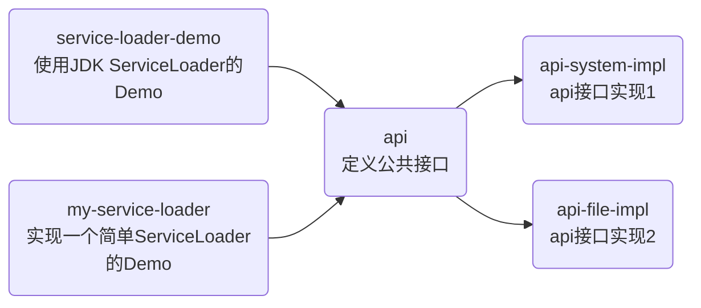
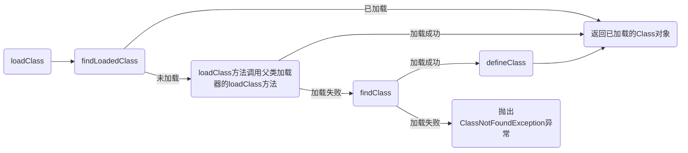

## 简介

该项目是研究SPI以及插件机制，含部分demo代码，源码阅读代码
## 项目整体



## SPI

SPI（Service Provider Interface）机制是Java提供的一种服务发现机制，用于实现组件之间的松耦合和可插拔性。

在SPI机制中，提供者（Service Provider）定义了一组接口或抽象类，而使用者（Service Consumer）可以通过SPI机制来发现并使用提供者的具体实现，而无需在代码中显式指定具体的实现类。

SPI机制的核心思想是通过在类路径下定义一个描述文件（META-INF/services/接口全限定名），文件中列出了提供者的具体实现类。使用者可以通过Java标准库提供的 `java.util.ServiceLoader` 类来加载并实例化这些实现类。

SPI机制的优点包括：

1. **松耦合**：使用者和提供者之间的依赖关系是通过接口进行定义，使用者不依赖于具体的实现类，而是依赖于接口。这样可以使系统的不同模块之间更加独立和解耦。
2. **可插拔性**：通过在类路径下添加或删除提供者的实现类，可以动态地切换和扩展系统的功能，而无需修改代码。
3. **扩展性**：SPI机制可以方便地支持第三方扩展。第三方开发者可以通过实现提供者接口并在描述文件中注册自己的实现类，从而扩展原有系统的功能。

总之，SPI机制是一种实现组件解耦和可插拔性的机制，使得系统更加灵活和可扩展，同时也给第三方扩展提供了便利。

### JDK ServiceLoader

#### 简单使用

参考项目代码 `service-loader-demo`


api 模块定义接口，这里定义了一个打印类

```java
package io.github.xiaoso456.api;

public interface Print {
    void println(String message);
}
```


api-file-impl 模块实现接口，作用把信息写入到文件，这里为了方便，仅仅是输出信息

```java
package io.github.xiaoso456.api;

public class PrintFileImpl implements Print {
    @Override
    public void println(String message) {
        String template =
        """
        "%s"已经写入到文件
        """;

        System.out.println(String.format(template,message));
    }
}

```

在  `resource/META-INF.services`  文件夹下新建SPI机制约定文件，文件名为接口名 `io.github.xiaoso456.api.Print `文件，内容如下，每行是一个接口实现

```
io.github.xiaoso456.api.PrintFileImpl
```


api-system-impl 模块实现接口，把信息输出到控制台

```java
package io.github.xiaoso456.api;

public class PrintSystemImpl implements Print{
    @Override
    public void println(String message) {
        System.out.println(message);
    }
}

```

在  `resource/META-INF.services`  文件夹下新建SPI机制约定文件，文件名为接口名 `io.github.xiaoso456.api.Print `文件，内容如下

```
io.github.xiaoso456.api.PrintSystemImpl
```


在 service-loader-demo 模块，引入了接口定义模块 `api`，以及两个模块实现类` api-system-impl`和`api-file-impl`，使用 JDK 提供的 ServiceLoader 获取服务实现

```java
public class Main {
    public static void main(String[] args) {
        ServiceLoader<Print> printServiceLoader = ServiceLoader.load(Print.class);
        Iterator<Print> printIterator = printServiceLoader.iterator();
        while(printIterator.hasNext()){
            Print printService = printIterator.next();
            printService.println("打印");
        }
    }
}
```

输出结果如下

```
打印
"打印"已经写入到文件
```

#### ServiceLoader 思路分析

下面摘取 ServiceLoader GraalVM JDK17 部分源码进行说明

```java
    public static <S> ServiceLoader<S> load(Class<S> service) {
        // 获取线程上下文加载器，一般获取到的是 应用级加载器
        ClassLoader cl = Thread.currentThread().getContextClassLoader();
        return new ServiceLoader<>(Reflection.getCallerClass(), service, cl);
    }


```

不考虑JDK9后模块化带来的特性部分，ServiceLoader 主要通过内部迭代器 `LazyClassPathLookupIterator` 来逐个加载的服务

```java
        @Override
        public boolean hasNext() {
            if (acc == null) {
                return hasNextService();
            } else {
                PrivilegedAction<Boolean> action = new PrivilegedAction<>() {
                    public Boolean run() { return hasNextService(); }
                };
                return AccessController.doPrivileged(action, acc);
            }
        }

        @SuppressWarnings("unchecked")
        private boolean hasNextService() {
            while (nextProvider == null && nextError == null) {
                try {
                    Class<?> clazz = nextProviderClass();
                    if (clazz == null)
                        return false;

                    if (clazz.getModule().isNamed()) {
                        // ignore class if in named module
                        continue;
                    }

                    if (service.isAssignableFrom(clazz)) {
                        // 通过反射实例化下游实现
                        Class<? extends S> type = (Class<? extends S>) clazz;
                        Constructor<? extends S> ctor
                            = (Constructor<? extends S>)getConstructor(clazz);
                        ProviderImpl<S> p = new ProviderImpl<S>(service, type, ctor, acc);
                        nextProvider = (ProviderImpl<T>) p;
                    } else {
                        fail(service, clazz.getName() + " not a subtype");
                    }
                } catch (ServiceConfigurationError e) {
                    nextError = e;
                }
            }
            return true;
        }


        /**
         * Loads and returns the next provider class.
         */
        private Class<?> nextProviderClass() {
            if (configs == null) {
                try {
                    // PREFIX 为 `META-INF/services/`  service.getName()就是被公共接口全限定名
                    String fullName = PREFIX + service.getName();
                    if (loader == null) {
                        configs = ClassLoader.getSystemResources(fullName);
                    } else if (loader == ClassLoaders.platformClassLoader()) {
                        // The platform classloader doesn't have a class path,
                        // but the boot loader might.
                        if (BootLoader.hasClassPath()) {
                            configs = BootLoader.findResources(fullName);
                        } else {
                            configs = Collections.emptyEnumeration();
                        }
                    } else {
                        // 通过全限定名获取加载所有 jar 下 classpath下 fullName 文件
                        configs = loader.getResources(fullName);
                    }
                } catch (IOException x) {
                    fail(service, "Error locating configuration files", x);
                }
            }
            // 读取文件新的一行
            while ((pending == null) || !pending.hasNext()) {
                if (!configs.hasMoreElements()) {
                    return null;
                }
                pending = parse(configs.nextElement());
            }
            String cn = pending.next();
            try {
                return Class.forName(cn, false, loader);
            } catch (ClassNotFoundException x) {
                fail(service, "Provider " + cn + " not found");
                return null;
            }
        }
```

简单来说做了下面几件事：

1. 读取所有加载 jar 下 `classpath` 文件夹`META-INF/services/<接口全限定名>` 文件
2. 每一行是实现类的全限定名，每次读取一行，通过反射实例化

下面章节会通过简单代码实现一个 ServiceLoader

### 实现一个简单的 ServiceLoader

代码可以参考项目  `my-service-loader`

要点主要如下

1. 获取所有 jar 包类路径下指定服务文件

```java
        String fileName = "META-INF/services/" + serviceType.getName();
        // 获取所有 jar 包类路径下指定服务文件 url
        Enumeration<URL> resources = Thread.currentThread().getContextClassLoader().getResources(fileName);
```

2. 读取文件，按行获取实现类全限定名，暂存到 serviceFullNames

```java
        // 服务实现类的全限定名list
        List<String> serviceFullNames = new ArrayList<>();
        while (resources.hasMoreElements()) {
            // 读取文件
            URL url = resources.nextElement();
            URLConnection urlConnection = url.openConnection();
            urlConnection.setUseCaches(false);

            InputStream inputStream = urlConnection.getInputStream();
            BufferedReader bufferedReader = new BufferedReader(new InputStreamReader(inputStream, StandardCharsets.UTF_8));

            // 逐行读取文件，每一行是服务一个实现类
            while (true) {
                String serviceFullName = bufferedReader.readLine();
                if (serviceFullName == null) {
                    // 如果读取下一行为null，说明文件读取完毕
                    break;
                }
                if ("".equals(serviceFullName.trim())) {
                    // 跳过空行
                    continue;
                }
                serviceFullNames.add(serviceFullName);
            }
        }
```

3. 通过反射实例化所有暂存到serviceFullNames中的类

```java
        // 实例化所有服务
        for (String serviceFullName : serviceFullNames) {
            Class<?> clazz = Class.forName(serviceFullName);
            // 获取构造函数
            Constructor<?> constructor = clazz.getDeclaredConstructor();
            // 设置构造函数可访问
            constructor.setAccessible(true);
            // 实例化类
            @SuppressWarnings("unchecked")
            T instance = (T) constructor.newInstance();
            serviceList.add(instance);
        }
```

### SpringBoot实现的SPI机制

Spring Boot对SPI机制进行了增强和简化，使得在Spring Boot应用中使用SPI更加方便

1. **自动配置（Auto-configuration）**：Spring Boot利用SPI机制实现了自动配置的功能。它定义了一系列的自动配置类，这些类通过在类路径中查找特定的SPI接口实现，来根据应用程序的依赖和配置自动配置Spring应用上下文的各个组件。
2. **条件化加载（Conditional loading）**：Spring Boot的自动配置类通过条件化加载机制来决定是否要应用某个特定的自动配置。条件化加载可以根据应用程序的环境、配置和依赖条件来决定是否加载某个自动配置类。
3. **Spring Factories Loader**：Spring Boot使用`META-INF/spring.factories`文件作为SPI的配置文件，该文件列出了所有需要加载的SPI接口实现类。Spring Boot会在启动时自动加载这些实现类，并根据配置来进行相应的初始化和注册。
4. **@Enable模块化注解**：Spring Boot提供了一系列的`@Enable`注解，用于启用特定的功能模块。这些注解通过SPI机制来查找并加载相应的自动配置类，从而实现特定功能的自动配置和集成。


#### 5.3.x Spring 2.x SpringBoot 思路分析

Spring 5的SPI机制主要是读取文件 `META_INF/spring.factories` 文件，并使用Spring的机制把相关类加入到扫描路径，一个 `spring.factories` 文件示例如下

```
org.springframework.boot.autoconfigure.EnableAutoConfiguration=\
  com.github.cloud.tutu.registry.TutuServiceRegistryAutoConfiguration,\
  com.github.cloud.tutu.discovery.TutuDiscoveryAutoConfiguration
```

格式为 `接口全限定名=实现类全限定名`


以Spring源码5.3.x为例，主要功能源码在 `SpringFactoriesLoader.java`

```java
	static final Map<ClassLoader, Map<String, List<String>>> cache = new ConcurrentReferenceHashMap<>();

	private static Map<String, List<String>> loadSpringFactories(ClassLoader classLoader) {
		Map<String, List<String>> result = cache.get(classLoader);
		if (result != null) {
			return result;
		}

		result = new HashMap<>();
		try {
            // 读取所有 jar 包 META-INF/spring.factories 文件
			Enumeration<URL> urls = classLoader.getResources(FACTORIES_RESOURCE_LOCATION);
			while (urls.hasMoreElements()) {
				URL url = urls.nextElement();
				UrlResource resource = new UrlResource(url);
				Properties properties = PropertiesLoaderUtils.loadProperties(resource);
				for (Map.Entry<?, ?> entry : properties.entrySet()) {
					String factoryTypeName = ((String) entry.getKey()).trim();
					String[] factoryImplementationNames =
							StringUtils.commaDelimitedListToStringArray((String) entry.getValue());
					for (String factoryImplementationName : factoryImplementationNames) {
						result.computeIfAbsent(factoryTypeName, key -> new ArrayList<>())
								.add(factoryImplementationName.trim());
					}
				}
			}

			// Replace all lists with unmodifiable lists containing unique elements
			result.replaceAll((factoryType, implementations) -> implementations.stream().distinct()
					.collect(Collectors.collectingAndThen(Collectors.toList(), Collections::unmodifiableList)));
			cache.put(classLoader, result);
		}
		catch (IOException ex) {
			throw new IllegalArgumentException("Unable to load factories from location [" +
					FACTORIES_RESOURCE_LOCATION + "]", ex);
		}
		return result;
	}

	@SuppressWarnings("unchecked")
	private static <T> T instantiateFactory(String factoryImplementationName, Class<T> factoryType, ClassLoader classLoader) {
		try {
			Class<?> factoryImplementationClass = ClassUtils.forName(factoryImplementationName, classLoader);
			if (!factoryType.isAssignableFrom(factoryImplementationClass)) {
				throw new IllegalArgumentException(
						"Class [" + factoryImplementationName + "] is not assignable to factory type [" + factoryType.getName() + "]");
			}
			return (T) ReflectionUtils.accessibleConstructor(factoryImplementationClass).newInstance();
		}
		catch (Throwable ex) {
			throw new IllegalArgumentException(
				"Unable to instantiate factory class [" + factoryImplementationName + "] for factory type [" + factoryType.getName() + "]",
				ex);
		}
	}
```

简单来说做了下面几件事：

1. 读取所有加载 jar 下 `classpath` 文件夹`META-INF/spring.factories ` 文件，文件每行是一对 `key:value`， key 是接口全限定名，value是实现类全限定名

2. spring各个生命周期会读取这个文件，按条件实例化

   

#### 6.x Spring 3.x SpringBoot

SpringBoot 3.x 读取的文件是 `META/spring/org.springframework.boot.autoconfigure.AutoConfiguration.imports`，一行一个实现类


## ClassLoader

ClassLoader在插件机制上可以说是SPI机制的一个补充，它负责将类字节码加载到内存中，并转换为可执行的 Java 类。类加载器具有以下功能和作用：

+ 类隔离：类加载器可以创建不同的类加载域，实现类的隔离和版本管理，不同的类加载器加载的类互相之间不可见。

+ 动态加载：类加载器可以在运行时动态加载类，灵活地引入新的类或资源，实现插件式的架构。

+ 模块化：类加载器可以支持模块化的应用程序结构，将应用程序划分为多个模块，每个模块具有独立的类加载器。

+ 热部署：类加载器可以实现热部署，即在应用程序运行时替换或升级类，而无需重启应用程序。

对于插件来说，如果要实现热部署重加载，需要破坏双亲委托模型，实现一个自定义的ClassLoader

### 关键方法




要实现自定义 ClassLoader，就要了解一些关键方法

+ `loadClass(String name)`：根据给定的类名加载类并返回 Class 对象。

+ `findClass(String name)`：查找并加载指定名称的类。
+ `defineClass(String name, byte[] b, int off, int len)`：定义一个新的类，并返回 Class 对象。

#### loadClass

使用指定的二进制名称加载类，默认实现按照以下顺序搜索类：

1. 调用 findLoadedClass(String name) 检查类是否已加载
2. 遵照双亲委托模型，优先调用父类加载器 loadClass方法加载类
3. 如果找不到，调用自身findClass(String name) 方法加载类

```java

    protected Class<?> loadClass(String name, boolean resolve)
        throws ClassNotFoundException
    {
        synchronized (getClassLoadingLock(name)) {
            // First, check if the class has already been loaded
            Class<?> c = findLoadedClass(name);
            if (c == null) {
                long t0 = System.nanoTime();
                try {
                    if (parent != null) {
                        c = parent.loadClass(name, false);
                    } else {
                        c = findBootstrapClassOrNull(name);
                    }
                } catch (ClassNotFoundException e) {
                    // ClassNotFoundException thrown if class not found
                    // from the non-null parent class loader
                }

                if (c == null) {
                    // If still not found, then invoke findClass in order
                    // to find the class.
                    long t1 = System.nanoTime();
                    c = findClass(name);

                    // this is the defining class loader; record the stats
                    PerfCounter.getParentDelegationTime().addTime(t1 - t0);
                    PerfCounter.getFindClassTime().addElapsedTimeFrom(t1);
                    PerfCounter.getFindClasses().increment();
                }
            }
            if (resolve) {
                resolveClass(c);
            }
            return c;
        }
    }
```

#### defineClass

defineClass 方法的工作流程如下：

1. 根据传入的字节数组 b、起始偏移量 off 和长度 len 创建一个新的 Class 对象。
2. 使用该类的全限定名 name 进行类的命名
3. 它会验证字节数组的格式是否符合 Java 类的规范。如果字节数组的格式不正确，将会抛出 ClassFormatError 异常。如果字节数组的格式正确，defineClass 方法会将类定义加载到内存中，并返回对应的 Class 对象。

注：defineClass 最终调用的是本地方法

```java
    protected final Class<?> defineClass(String name, byte[] b, int off, int len)
        throws ClassFormatError
    {
        return defineClass(name, b, off, len, null);
    }
```

#### findClass

findClass 方法的工作流程如下：

1. 尝试根据指定的类名称 name 进行查找和加载类。
2. 在自定义类加载器中，可以根据需要实现自定义的查找和加载逻辑。这可以包括从特定的位置加载类文件、从网络下载类文件或者从其他来源获取类定义的字节码数据。
3. 如果 findClass 方法能够成功加载类，则返回对应的 Class 对象。如果 findClass 方法无法找到或加载类，则会抛出 ClassNotFoundException 异常。

```java
    protected Class<?> findClass(String name) throws ClassNotFoundException {
        throw new ClassNotFoundException(name);
    }
```

findClass由子类实现

### 测试用外部插件

代码如下，编译为 .class 和 .jar 文件以备使用

```java
package io.github.xiaoso456;
import java.util.Objects;
public class MyPlugin {

    private String name;
    private String version;

    static {
        System.out.println("加载插件成功");
    }
}
```


### 简单的自定义ClassLoader加载class

SimpleClassLoader 作用是加载一个外部 .class 文件

SimpleClassLoader 的作用很有限，创建 SimpleClass 时传入 .class 文件地址，重写findClass方法，

```java
public class SimpleClassLoader extends ClassLoader {

    private String classPath;

    public SimpleClassLoader(String classPath) {
        this.classPath = classPath;
    }

    @Override
    protected Class<?> findClass(String name) {
        byte[] bytes = FileUtil.readBytes(classPath);
        return defineClass(name, bytes, 0, bytes.length);
    }

}

```

测试类

```java
public class TestSimpleClassLoader  {

    @Test
    void testTestSimpleClassLoader() throws ClassNotFoundException, NoSuchMethodException, InvocationTargetException, InstantiationException, IllegalAccessException {
        SimpleClassLoader simpleClassLoader = new SimpleClassLoader("D:\\code\\project\\idea_project\\spi-demo\\my-plugin\\target\\classes\\io\\github\\xiaoso456\\MyPlugin.class");
        Class<?> myPluginClass = simpleClassLoader.loadClass("io.github.xiaoso456.MyPlugin");

        Object instance = myPluginClass.getDeclaredConstructor().newInstance();

        System.out.println(instance);
    }
}
```

输出结果

```
加载插件成功
MyPlugin{name='null', version='null'}
```

### 简单的自定义ClassLoader加载jar

JAR（Java Archive）是一种用于打包和分发 Java 程序和相关资源的文件格式。它将多个 Java 类文件、资源文件、配置文件和其他文件组合在一起，形成一个可执行的、可部署的单元。

Jar 包是使用 ZIP 算法压缩得到的，一种最简单的方法就是先把 Jar包解压，再读取其中的 .class 文件即可

Jdk也提供一些方法，可以直接读取jar内class

```java
package io.github.xiaoso456.loader;

import cn.hutool.core.io.IoUtil;

import java.io.IOException;
import java.io.InputStream;
import java.util.jar.JarEntry;
import java.util.jar.JarFile;

public class JarSimpleClassLoader extends ClassLoader {

    private String jarPath;

    public JarSimpleClassLoader(String jarPath) {
        this.jarPath = jarPath;
    }
    

    @Override
    protected Class<?> findClass(String name) {
        String classPath = classnameToPath(name);
        try (JarFile jarFile = new JarFile(jarPath, false)) {
            JarEntry jarEntry = jarFile.getJarEntry(classPath);
            InputStream classInputStream = jarFile.getInputStream(jarEntry);
            byte[] classBytes = IoUtil.readBytes(classInputStream);
            return defineClass(name, classBytes, 0, classBytes.length);
        } catch (IOException e) {
            throw new RuntimeException(e);
        }

    }

    /**
     * 把 io.github.xiaoso456.MyPlugin 这种类名转化为jar包格式class文件路径 io/github/xiaoso456/MyPlugin.class
     *
     * @param classname 类全限定名
     * @return class 文件路径
     */
    private String classnameToPath(String classname) {
        return classname.replaceAll("\\.", "/") + ".class";
    }

}

```

测试类

```java

public class TestJarSimpleClassLoader {

    @Test
    void testTestSimpleClassLoader() throws ClassNotFoundException, NoSuchMethodException, InvocationTargetException, InstantiationException, IllegalAccessException {
        JarSimpleClassLoader jarSimpleClassLoader = new JarSimpleClassLoader("D:\\code\\project\\idea_project\\spi-demo\\my-plugin\\target\\my-plugin.jar");
        Class<?> myPluginClass = jarSimpleClassLoader.loadClass("io.github.xiaoso456.MyPlugin");

        Object instance = myPluginClass.getDeclaredConstructor().newInstance();

        System.out.println(instance);
    }
}

```

输出

```
加载插件成功
MyPlugin{name='null', version='null'}
```

## Nacos中的插件机制

以2.2.x的nacos源码分析

插件接口： nacos-plugin 模块

自定义的ClassLoader：common模块`com.alibaba.nacos.common.spi.NacosServiceLoader`

先看SERVICES，结构如下`接口类:list{接口实现类1,接口实现类2}` ,了解到存储结构后就很简单了，这个自定义的ServiceLoader流程如下：

1. 如果service接口类已经被加载过，反射实例化保存在 SERVICES 中该接口的实现类
2. 如果没有被加载过，使用 JDK ServiceLoader加载实例化，并把实现类记录到 SERVICES 中

```java
public class NacosServiceLoader {
    
    private static final Map<Class<?>, Collection<Class<?>>> SERVICES = new ConcurrentHashMap<>();
    
    /**
     * Load service.
     *
     * <p>Load service by SPI and cache the classes for reducing cost when load second time.
     *
     * @param service service class
     * @param <T> type of service
     * @return service instances
     */
    public static <T> Collection<T> load(final Class<T> service) {
        if (SERVICES.containsKey(service)) {
            return newServiceInstances(service);
        }
        Collection<T> result = new LinkedHashSet<>();
        for (T each : ServiceLoader.load(service)) {
            result.add(each);
            cacheServiceClass(service, each);
        }
        return result;
    }
    
    private static <T> void cacheServiceClass(final Class<T> service, final T instance) {
        if (!SERVICES.containsKey(service)) {
            SERVICES.put(service, new LinkedHashSet<>());
        }
        SERVICES.get(service).add(instance.getClass());
    }
    
    /**
     * New service instances.
     *
     * @param service service class
     * @param <T> type of service
     * @return service instances
     */
    public static <T> Collection<T> newServiceInstances(final Class<T> service) {
        return SERVICES.containsKey(service) ? newServiceInstancesFromCache(service) : Collections.<T>emptyList();
    }
    
    @SuppressWarnings("unchecked")
    private static <T> Collection<T> newServiceInstancesFromCache(Class<T> service) {
        Collection<T> result = new LinkedHashSet<>();
        for (Class<?> each : SERVICES.get(service)) {
            result.add((T) newServiceInstance(each));
        }
        return result;
    }
    
    private static Object newServiceInstance(final Class<?> clazz) {
        try {
            return clazz.newInstance();
        } catch (IllegalAccessException | InstantiationException e) {
            throw new ServiceLoaderException(clazz, e);
        }
    }
}

```

以nacos中鉴权spi管理为例 `com.alibaba.nacos.plugin.auth.spi.server.AuthPluginManager`，创建时加载一次

```java
public class AuthPluginManager {
    
    private static final Logger LOGGER = LoggerFactory.getLogger(AuthPluginManager.class);
    
    private static final AuthPluginManager INSTANCE = new AuthPluginManager();
    
    /**
     * The relationship of context type and {@link AuthPluginService}.
     */
    private final Map<String, AuthPluginService> authServiceMap = new HashMap<>();
    
    private AuthPluginManager() {
        initAuthServices();
    }
    
    private void initAuthServices() {
        Collection<AuthPluginService> authPluginServices = NacosServiceLoader.load(AuthPluginService.class);
        for (AuthPluginService each : authPluginServices) {
            if (StringUtils.isEmpty(each.getAuthServiceName())) {
                LOGGER.warn(
                        "[AuthPluginManager] Load AuthPluginService({}) AuthServiceName(null/empty) fail. Please Add AuthServiceName to resolve.",
                        each.getClass());
                continue;
            }
            authServiceMap.put(each.getAuthServiceName(), each);
            LOGGER.info("[AuthPluginManager] Load AuthPluginService({}) AuthServiceName({}) successfully.",
                    each.getClass(), each.getAuthServiceName());
        }
    }
    
    public static AuthPluginManager getInstance() {
        return INSTANCE;
    }
    
    /**
     * get AuthPluginService instance which AuthPluginService.getType() is type.
     *
     * @param authServiceName AuthServiceName, mark a AuthPluginService instance.
     * @return AuthPluginService instance.
     */
    public Optional<AuthPluginService> findAuthServiceSpiImpl(String authServiceName) {
        return Optional.ofNullable(authServiceMap.get(authServiceName));
    }
    
}
```


## 参考

ChatGPT

[实现ClassLoader - 廖雪峰的官方网站 (liaoxuefeng.com)](https://www.liaoxuefeng.com/wiki/1545956031987744/1545956487069728)

[Java 基础：ClassLoader理解和实现_java的classloader_RayBreslin的博客-CSDN博客](https://blog.csdn.net/u010886217/article/details/103488684)
